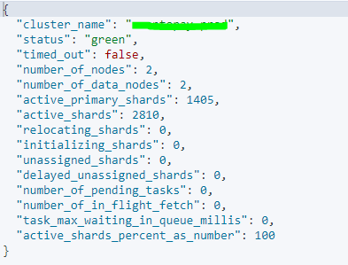
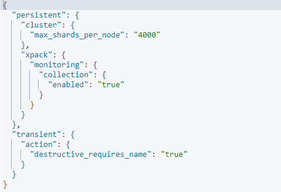
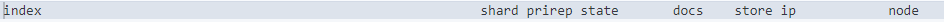
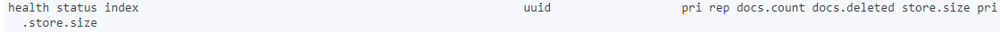

<h2>Check the Cluster Status</h2>
Command: GET _cluster/health

 

<h2>Check the Cluster Settings</h2>
Command: GET /_cluster/settings

 

<h2>Check the Cluster Settings including default settings
Command: GET _cluster/settings?include_defaults

<h2>To see all the shards in nodes<h2> 
Command: GET _cat/shards?v

 

index: index name
prirep: indicate whether it's a primary or replica shard
state: show the state of the shards
docs: defines numbers of documents in a shard
store: define the size of the shard
ip: defines on which ip the shard is alocated
node: show the name of the node on which shard is present

<h2>To see the details of particular index</h2>
command: GET index_name/_settings?pretty

<h2>To see all the indices in the cluster with details</h2>
command: GET _cat/indices?v

 

health: Health of index (green,yellow,red)
status: open or close
index: index name
uuid: uuid of index
pri: number of primary shards
rep: number of replica shards
docs.count: number of documents in index
docs.deleted: number of deleted documents
store.size: totat size of the index (including primary shards size and replica shards)
pri.store.size: total size of primary shard

<h2>Heap size of all the nodes allocated</h2>
command: GET _cat/nodes?v=true&h=heap.max

<h2>To increase the total number of shards in cluster</h2>
default number of shards in a cluster is 2000

PUT _cluster/settings
{
  "persistent" : {
    "cluster.max_shards_per_node": 3000
  }
}

<h2>To delete multiple index in one go enable this cluster setting</h2>

PUT /_cluster/settings
{
  "transient": {
	"action.destructive_requires_name":false
  }
}

<h2>To prevent from deleting multiple index in one go enable this cluster setting</h2>
PUT /_cluster/settings
{
  "transient": {
	"action.destructive_requires_name":true
  }
}

<h2>Create Index</h2>
PUT /index-name

<h2>Reindex</h2>
Combine multiple indices into a single index

POST _reindex
{
  "source": {
    "index": ["index-1","index-2"]
  },
  "dest": {
    "index": "new-index"
  }
}

OR

POST _reindex
{
  "source": {
    "index": "index*"
  },
  "dest": {
    "index": "new-index"
  }
}

<h2>Delete index</h2>
DELETE /indexname